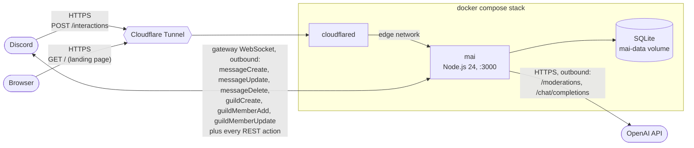

# Mai

<p align="center">
  
</p>

Docker Compose stack running **Mai**, a Discord bot with a cat persona, behind a Cloudflare tunnel. Moderation and chat run inside the bot: it classifies messages and generates replies through the OpenAI API and keeps its state in a local SQLite database.

## Architecture



- **`mai`**: Node.js 24 Discord app: HTTP interactions endpoint (slash commands, buttons, modals), gateway listener for messages, moderation pipeline, chat, and an in-process scheduler. See [mai/README.md](mai/README.md).
- **`cloudflared`**: Cloudflare tunnel exposing the interactions endpoint to Discord without open ports. Browsers hitting the tunnel URL get a static landing page instead of an error.

The gateway connection is outbound, so message listening keeps working even when the tunnel is down; cloudflared is only needed for the interactions endpoint.

## Moderation

Every new **and edited** message in an allowlisted guild (`DISCORD_GUILD_IDS`) is classified. Message content is never persisted: only IDs, category labels and timestamps:

- **The server's own rules first** → invite links, links outside an allowlist, mass mentions and message floods are decided locally, before any API call: they cost nothing, they catch what a meaning-based score cannot (an advertisement is a polite invite link, a raid is twenty harmless lines), and they keep working while the classifier is down. All off by default, all per server.
- **Flagged** → warning reaction, a scold reply, and a queue row with a grace period.
- **After the grace period** → messages the author did not delete themselves are removed and the author gets a warning DM. The scold reply is cleaned up either way.
- **Edited** → re-classified, so the edit button is not a way past the check. The verdict cuts both ways: an edit that fixes a flagged message takes the warning reaction, the scold reply and the queue row back off it. Editing one violation into another refreshes the categories but keeps the original deadline.
- **`/mai ask`** → the question is classified before Mai quotes it back into the channel. Her own replies are deliberately *not* classified: she is written to get ruder the more open violations someone has, and a filter would cut exactly that.
- **Display names** → optionally screened on join and on rename, because a nickname sits on every message its owner sends and no message rule can see it. Mai reports it, and at most removes the server nickname: a global username is not hers to change, and she never kicks or bans over a name.

Enforced deletions add up: a strike record drives an escalation ladder that ends in a Discord timeout ([mai/README.md](mai/README.md#moderation)). Mai never kicks or bans on her own, because an automated permanent action on a false positive is not recoverable.

Every action can also be mirrored into a staff channel as an embed: metadata only, never message content ([mai/README.md](mai/README.md#moderation-log)). Two of those entries are about Mai failing rather than a member: a warning DM that bounced (the member was enforced without ever being told why), and classification going down, because moderation fails open on purpose and an outage otherwise looks exactly like a quiet afternoon.

How hard Mai judges is per server too: `/mod config set threshold` decides violations on the classifier's own scores instead of its English-tuned default, and `/mod exempt add` leaves a channel alone entirely (chat and reactions keep working there). A server can find its threshold before living with it: **shadow mode** reports every verdict into the log channel with the score behind it and acts on none of them, and `/mod simulate <text>` answers the same question for one sentence on demand.

Staff can also act *through* Mai instead of only undoing her: a right-click deletion that records the strike, `/mod warn` for a word from the team, and `/mod note` for what the team knows but no counter records. All three land in the same file, so the next moderator reads one history instead of two.

Members are not only on the receiving end: anyone can report a message to staff (right-click → *Apps* → *Nachricht melden*), and a warning DM carries an *Einspruch einlegen* button (`/mai appeal` for members whose DMs are closed, so a bounced warning does not also cost them the appeal). Both land in the server's log channel with decision buttons, and granting an appeal overturns exactly the strikes it was about ([mai/README.md](mai/README.md#reports-and-appeals)). A server can also let Mai keep the enforced messages themselves for a few hours, encrypted, so whoever decides the appeal can read what it is about instead of taking somebody's word for it: off by default, two switches to turn on, and shown to one moderator privately rather than posted anywhere.

## Commands

Full reference, option by option: **[COMMANDS.md](COMMANDS.md)**. What they are
for:

| I want to … | Command |
|---|---|
| set her up on a new server | `/mod setup <preset>`, or the buttons she posts on joining |
| ask Mai something in public | `/mai ask <frage>` |
| make her forget what I told her | `/mai forget` |
| appeal a warning whose DM never arrived | `/mai appeal` |
| report a message to the team | right-click → *Apps* → *Nachricht melden* |
| see whether Mai is working, and what is queued | `/mod status` |
| look up what a member has done here | `/mod history <user>` |
| take back a punishment | `/mod forgive <user> [strikes]` |
| have a word with somebody, from the team | `/mod warn <user> [reason]` |
| write down what the team knows about them | `/mod note add\|clear <user>` |
| delete a message myself, on the record | right-click → *Apps* → *Löschen* |
| find out where to put the threshold | `/mod simulate <text>`, or `shadow` mode |
| stop her moderating one channel | `/mod exempt add <channel>` |
| stop her completely, for now | `/mod off` (and `/mod on`) |
| change how she behaves on this server | `/mod config view\|set\|reset` |
| see what she is costing | `/mod spend` |

Everything a moderator sees and does is scoped to their own server, and every
settings change is announced in that server's log channel. Whoever runs the bot
(`OPERATOR_USER_IDS`) additionally sees the process-wide figures.

## Looking after herself

Mai is meant to run without somebody watching her, so three things are hers to
notice rather than yours. She **introduces herself once** in every server she
joins, with three setup presets on buttons, because the honest default for every
house rule is "off" and a server that never works through the options is running
a moderation bot that moderates nothing. She **checks her own permissions** at
startup, on joining and in `/mod status`, because every one of them is otherwise
discovered by failing at the worst possible moment. And she **restarts herself**
when the moderation loop stops making progress, because an unhealthy container
that Docker will not restart is a bot that is quietly doing nothing.

## Mai: the bot persona

The bot is **Mai**, the server's cat-moderator. Mentioning her, replying to her messages, or sending her a direct message gets an in-character reply (OpenAI, cat persona, short per-channel memory). Direct messages skip moderation (a bot cannot delete a DM) and are only accepted from users who share an allowlisted server with her. Her conversation memory is kept a few hours to give her context, then deleted; it is encrypted at rest (AES-256-GCM). While a member has an un-enforced violation, Mai turns aggressive toward them wherever they talk to her. She also reacts to trigger words (🐟, 😺), uses the server's own emotes rather than inventing codes for them, and can welcome new members ([mai/README.md](mai/README.md)). Where the operator set a `GIPHY_API_KEY` and the server ran `/mod config set gifs:true`, she can also search for a GIF and hang it on her reply: the model writes a search term and never an address, and only a GIPHY media host is ever posted.

Everything she says (persona, prompts, scold lines, welcome messages, reaction triggers) lives in [mai/config/mai.yaml](mai/config/mai.yaml). Secrets, models and limits live in `.env`.

## Quick start

```sh
# 1. Configure secrets
cp .env.example .env   # then fill in the values:
                       #   DISCORD_BOT_TOKEN / DISCORD_PUBLIC_KEY / DISCORD_APP_ID
                       #   OPENAI_API_KEY
                       #   CHAT_HISTORY_KEY=$(openssl rand -base64 32)
                       #   CLOUDFLARED_TUNNEL_TOKEN

# 2. Build and start
docker compose up -d --build

# 3. Register slash commands (once, and after command changes)
docker compose run --rm mai npm run register
```

Discord-side setup (intents, tunnel hostname, interactions endpoint URL) is documented in [mai/README.md](mai/README.md).

## Security baseline

All services run with `no-new-privileges`, `cap_drop: ALL`, read-only root filesystem, tmpfs-only writes, resource limits, and log rotation. The bot's only writable location is the `mai-data` volume holding the SQLite database. Secrets live only in `.env` (gitignored).

The interactions endpoint is public through the tunnel, so a rate limit and a body-size cap run *in front of* the Ed25519 signature check. `GET /metrics` on the same server is process-wide operator data and therefore 404s unless `METRICS_TOKEN` is set, then wants it as a bearer token. Message content is stored in exactly two places, both encrypted at rest (AES-256-GCM) and both on a short clock: Mai's chat memory, and the enforced messages a server may opt into keeping for an appeal review.
